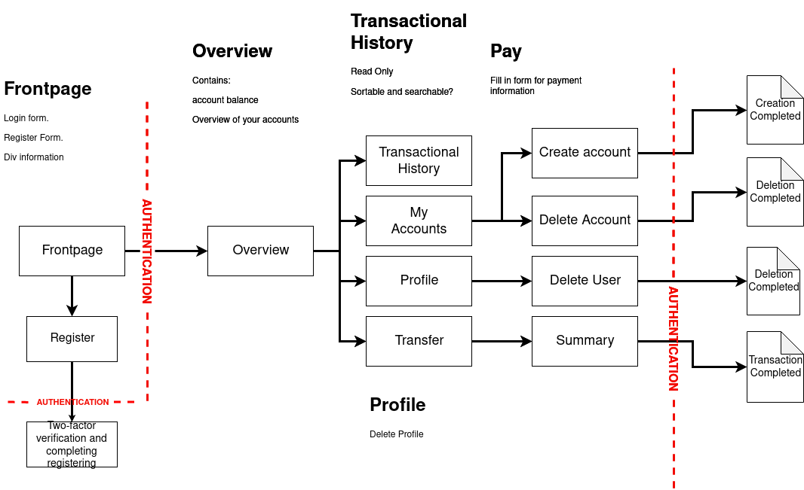
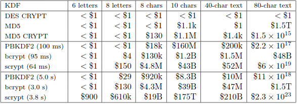

# Structure

To structure our website we make use of a number of various frameworks and tools to make everything work securely. Our website is built upon the popular python web-framework Flask. The main reason as to why we make use of an external framework such as Flask, is to maintain security by using a much used, respected and documented framework that has already been tried and tested by many industry professionals. It also has packages for all the functionality that is needed to make a functional website for many different types of applications, providing tools such as session-handling, easy database management and more.

## Encryption and hashing
For hashing our users password, we elected to use `Scrypt` over alternatives such as `bcrypt` and `argon2`. While we had initially planned on using `bcrypt` we quickly realized that wouldn't be as good as the alternatives due to certain security flaws, and critically also the password length. From there it was an abritrary choice between `argon2` and `scrypt`.

As for encryption we have made our own encrypt and decrypt functions which make use of Fernet. It uses a random fernet generated key to encrypt user information such as email, secret (2fa), owned accounts (in the user table). For security the fernet key is then also encrypted again using the hashed password as key, also using Fernet. This way the only way anything gets decrypted is by the user providing their own password, and not even the administrators of the website could access the sensitive data, let alone a malicious actor.

## Site structure

Our sitemap looks like this. The only websites available without any form of authentication is the front page and register pages. From the register page we also render another html within the same route in register to verify the users 2FA-token, as they need to get their 2FA token set up to even log in at all.

As illustrated below, there are two authentication walls, one for login, and one for completing transactions. Both these require 2 factors to complete, those being by password, and by TOTP (timed one-time passwords).

 

\newpage

## Tools & Packages

The tools and packages that are used to make Safecoin.tech:

### Two-Factor Authentication
For 2FA we use TOTP codes generated for the user in their authentication app of choice. To generate these codes we make use of the packages `pyotp` and `flask-qrcode`. The QR-code is there as a user-friendly way to add the 2fa code to their app. We have not yet added a way to display the secret-key directly to the user on the site however, as we don't want to compromise security. 

#### flask-qrcode
The main reason why we elected to use `flask-qrcode` over any other qr-code making packages is due to the fact that by using `flask-qrcode` we can generate the QR-link without ever having to save it as an image on our server. We want to manage sensitive data that is unencrypted as little as possible, and by generating it as the html is rendered allows us to do just this. The reason why we want to do things like this is because this would be a breach of security as the QR-code is generated with the data for the users email, the issuer, and the secret key. If any malicious party got their hands on this QR-code they would know anyones email, secret key and which site to use these on, thus they would only miss your password and they have full access to your banking information.

Initialize QR-functionality in init.py
```python
QRcode(app)
```
We then make the QR-link as we need it, pass it on to the relevant html, passing into it the variable qr_link which holds the otpauth information that gets encoded into the QR-code.

The QR-code is then generated by this function directly in the html:
```html

```

#### pyotp - Python One-Time Password Library
To generate the link we use in the generated QR-code we use the well documented `pyotp` package. By using this the process of making the link and getting it generated by `flask-qrcode` is done very easily and with few lines of code needed.

```python
secret_key = pyotp.random_base32()

qr_link = pyotp.totp.TOTP(secret_key).provisioning_uri(name=form.email.data, 
issuer_name="Safecoin.tech")
```

The secrey key is a randomly generated 16 character base32 secret that is compatible with google authenticator and other OTP apps. These look like `'POAATUEFZ5O4RFSN'` and `'LCUSQXJLUMKYIDVF'` as examples.

To generate the QR-code using the link, we just need to return the `qr_link` to the new html page like this:

```python
return render_template('TwoFactor.html', form2 = form2, qr_link = qr_link)
```

#### Authentication app
For our users to authenticate they need to make use of any authentication app of choice. Without this they will not be able to sign in, as 2FA is required every time they want to log in, or complete transactions. This is made as easy to do as possible, as everyone is required to add their account to their app of choice already in the register progress, so there is no additional steps required after signing up before logging in. Possible apps include google authenticator, authy, microsoft authenticator and many more.


### Flask_Scrypt
`Flask_Scrypt` is a flask extension used to generate scrypt password hashes and random salts. The extension provides us with 3 functions that handle everything related to encrypting, generating salts and checking whether the provided password is the same as the one we have stored.

```python
generate_password_hash(password, salt, N=16384, r=8, p=1, buflen=64)
generate_random_salt(byte_size=64)
check_password_hash(password, password_hash, salt, N=16384, r=8, p=1, buflen=64)
```

These three relatively simple functions made it very simple for us to create and store not only encrypted passwords, but also to hash other database entries such as emails and other things. 

 

The above table shows a very approximate cost of brute-forcing a password of a specified length in 2002. While technology has advanced far beyond 2002, the table still functions as an approximate estimation on how scrypt compares to many other hashing algortithms.

The hashing algortithms `bcrypt` and `argon2` were also considered as alternatives to `scrypt`. After some research we relatively quickly decided that `scrypt` would be the best fit for our usecase, as it not only is secure, but also is very easy to use. `Bcrypt` lost out as it had known security flaws compared to the other alternatives, aswell as can be seen in the table above, it is far less secure. `Argon2` on the other hand was a real consideration, however `scrypt` was chosen instead of it. Scrypt was chosen becuase of its' better resistance to large scale brute force attacks. It manages this by not only scaling the cpu-usage, but the memory-usage as well. This approach makes it very expensive to excecute a parallelized attack.

(source: http://www.tarsnap.com/scrypt/scrypt.pdf)
 

### flask_sqlalchemy
From SQLalchemy's website: "The main goal of SQLAlchemy is to change the way you think about databases and SQL!" SQLalchemy was designed to be for efficient and high-performing database access, adapted into a simple and pythonic language, in other words a tool designed to make database-management effiecient and easy-to-use. The library automates redundant and time-consuming processes while the administrator retains the control of how the database is designed and how the SQL is constructed.

It was a simple choice to go for `SQLalchemy` as it is such an easy and highly efficient tool to use to make clear and tidy database instructions, while at the same time eliminating the risk of SQL-injection attacks. Using a library like `SQLalchemy` is therefore a massive advantage for us in terms of not only easy-of-use and efficiency, but also providing security by making all database queries sanitized by default.

(Source: https://www.sqlalchemy.org/)

### flask_login
`Flask-login` is a great flask package for handling user sessions management. We use `flask-login` alongside redis to handle sessions. `Flask-login` handles most of the common stuff like logging in, logging out, aswell as remembering users' sessions over extended periods of time.

`Flask-login` provides a wide array of functionality and will handle stuff like:
- Store active users' IDs in the sessions, and let your log them in and out easily.
- Restrict views to logged-in (or logged-out) users.
- Help protect users' sessions from being stolen by cookie thieves.
- Ease of use.

Perhaps the most important thing `flask-login` does for us is manage our user class, by providing every logged in user "object" with the following properties and methods:

- \<user\>.is_authenticated
- \<user\>.is_active
- \<user\>.is_anonymous
- \<user\>.get_id()

The package also handles other things, but this is the main use-case. Using `flask-login` we are left entirely free to use however we want our users to be loaded, user registration, permissions, requirements etc.

### WTForms & flask_wtf
We use `WTForms` along with `flask_wtf` to handle all fields where we require user to input data, such as email-fields, password-fields, payment-fields, KID-fields etc. 

flask_wtf handles the FlaskForm class, and subsequent forms we want to make as classes, that are then compatible with html and can be used there to get data that can then be managed in the backend python. The fields within a form, e.g. any one string field for email, will be handled by `WTForms`. From the WTForms package we import the classes for the forms we need, such as `StringField, PasswordField, BooleanField` and more. It also handles validators for these fields, such as `DataRequired(), Length and EqualTo()`. (EqualTo can be used for "confirm password" fields).

Such a form class could look something like this:

```python
class LoginForm(FlaskForm):
    email = StringField('Email', validators=[DataRequired(), Email()], 
    render_kw={"placeholder": "email@example.com"})
    password = PasswordField('Password', validators=[DataRequired()], 
    render_kw={"placeholder": "password"})
    otp = IntegerField('Two-factor Authentication', validators=[DataRequired()], 
    render_kw={"placeholder": "Two-Factor Authentication"})
    remember = BooleanField('Remember me')
    submit = SubmitField('Login')
```

### base64
Ardijan

### cryptography
Ardijan

### JSON
Ardijan

### Redis
Ardijan


We use redis to manage session timeouts, and as a volatile data management system.
 
