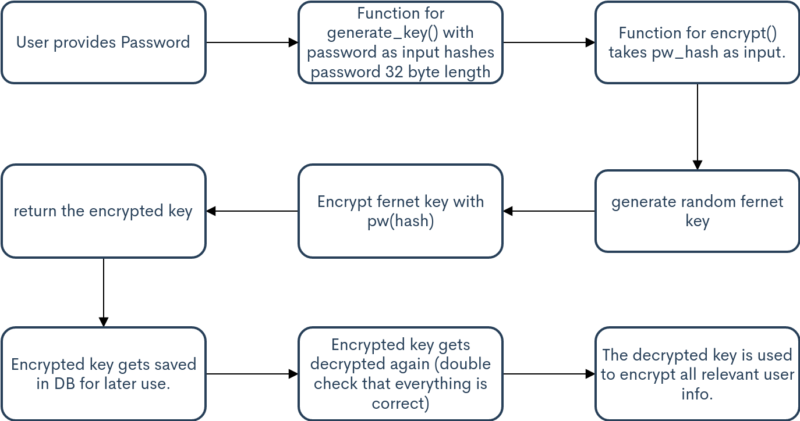

# Registration

 

On the registration page, the user will have to input the following.

## Email
At Safecoin, the users email will be used as the username. During the registration process, the email will be hashed with scrypt's hash-function without a salt, and compared with the other hashed emails in the database. The page will return a generic error if it is already in use. 

## Password
Password requirements:
  - Minimum 12 characters in length
  - Not an integer
  - Cannot match top 10000 most common passwords
  - Cannot contain the users email address
  
The users password is cryptographically hashed with scrypt and a random salt. 
These are as mentioned in  the previous chapter concatenated and stored together.

Scrypt allows the password to be of an arbitrary length, within reason. 

## TwoFactor Authentication
If the user passes both the email and password-checks, the user will be sent over to a page to complete two-factor-authentication setup. The user will be presented a QR-code that can be scanned in a authenticator app. During this registration process, we temporarily store the user information in its encrypted final form until the user finishes 2FA setup and is only written to the database upon completion.
