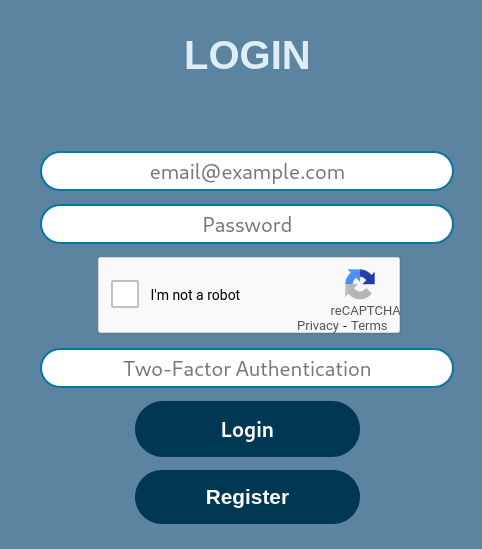

# OWASP Top Ten
In this chapter we will go through the each prevention we have implemented for the the OWASP Top 10 vulnerabilities. Some of the OWASP 10 prevention measures are not implemented because they are not applicable or too complex to implement for this project. 

Every subsection title is the prevention measure as written in the OWASP Top 10 document [-@OWASP10]

## Injection

### The preferred option is to use a safe API, which avoids the use of the interpreter entirely or provides a parameterized interface, or migrate to use Object Relational Mapping Tools (ORMs).
We use the flask-API `flask_sqlalchemy` and strictly only query the database through it. This is not inherently safe on it's own, but used correctly it mitigates or completely eliminates the possibility of an SQL-injection attack.

Example:

```python
def getAccount(account_number):
    account: Account = Account.query.filter_by(number=account_number).first()
    return account
```

The above "query.filter_by" sanitizes input by default and is the only method used to query the database. The only exception being:

```python
#Sanetize input illegalChar(text,maxlength,"string Allowed chars")
illegal=illegalChar(transForm.accountSelect.data,11,"0123456789")

if (str(transForm.accountSelect.data) in str(accountList)) and illegal==False:
    query=Transactions.query.filter((Transactions.accountFrom == 
            transForm.accountSelect.data) | (Transactions.accountTo == 
              transForm.accountSelect.data))

    TransList=QueryToList(query, accountList, transForm.accountSelect.data)
else:
    pass
    #TODO LOG THIS!
```
Here we get input from the user about which account history the user wants to view. The method "query.filter" is not considered safe. Since the account number can be converted to an integer and back, any dangerous value would prevent this conversion, thus raise and exception and skip the query.
The account number is also looked up in the user's account list. These safety measures make this query safe.

### Use positive or "whitelist" server-side input validation. This is not a complete defense as many applications require special characters, such as text areas or APIs for mobile applications.

As seen in the example above, input validation is used to ensure database queries are safe from sql-injection. We specifically require there to be no special characters and for general input fields, we use an illegal character checking function:

It checks the input text character by character and only allows the characters that exists it the alphabet to be used.
In the above code you can see how its implemented and that it allowes nothing but numbers, not even spaces.
```python
def illegalChar(text, maxlength,alphabet="abcdefghijklmnopqrstuvwxyzæøå0123456789 "):
    if text==None:
        return False

    try:
        text=str(text)
    except:
        return True

    if len(text)>maxlength:
        return True

    #Transform name to lowercase and check if its not in the alphabet
    for letter in text.lower():
        if letter not in alphabet:
            return True
    return False
```

## Broken Authentication


### Where possible, implement multi-factor authentication to prevent automated, credential stuffing, brute force, and stolen credential re-use attacks.

We implement multi-factor authentication and Google's reCAPTHCA on the login page to prevent automated attacks. Whereever autheticaton is required after the user is logged in, two factor authentication is also required.

{width=50%}


### Implement weak-password checks, such as testing new or changed passwords against a list of the top 10000 worst passwords.
Password requirements:

- Minimum 12 characters in length

- Not an integer

- Cannot match top 10000 most common passwords that are 12 characters or longer

- Cannot contain the users email address

The users password is cryptographically hashed with scrypt and a random salt. 
The password and its salt are then concatinated and stored together.

Scrypt allows the password to be of an arbitrary length.

Code for the password requirements:
```python
def getPasswordViolations(errList, password, email):
    if type(password) != str:
        errList.append("An error occurred!")
        return

    if isCommonPassword(password):
        errList.append("Password is too common")
        return

    if "safecoin" in password.lower() or email.lower() in password.lower():
        errList.append("Please choose a better password")
        return

    # Password params
    cfg = ConfigParser()
    cfg.read("safecoin/config.ini")
    policy = cfg["passwordPolicy"]
    try:
        want_length = int(policy["length"])
    except (KeyError, TypeError):
        want_length = 12

    if len(password) < want_length:
        errList.append(f"Password should be at least {want_length} characters")

def isCommonPassword(password):
    with open("safecoin/commonPasswords.txt", "r") as f:
        for weakpwd in f:
            if password == weakpwd[:-1]:
                return True
    return False
```

### Ensure registration, credential recovery, and API pathways are hardened against account enumeration attacks by using the same messages for all outcomes

While developing the website we had generic errors in mind as a measure to prevent account enumeration. The code-snippet below contains a short example:

```python

    else:
        # Generisk feilmelding dersom noe går galt
        flash('Something went wrong. Please try again.')
        log_loginattempt(False, userDB.email)
else:
    # Generisk feilmelding dersom noe går galt
    flash('Something went wrong. Please try again.')
    log_loginattempt(False, userDB.email)


#example from register page where this is the only error message
flash("Couldn't continue, due to an error", "error")

```
An attacker will in this case not be able to determine whether an account exists in the database or not.

### Use a server-side, secure,built-in session manager that generates a new random session ID with high entropy after login. Session IDs should not be in the URL, be securely stored and invalidated after logout, idle, and absolute timeouts.

We use flask_login to manage users sessions, this is built in and this generates a new session ID with every browser instance when
session_protection is set to strong.

```python
app.config['SECURITY_TOKEN_MAX_AGE'] = 3600
app.config['PERMANENT_SESSION_LIFETIME'] = 3600
app.config['REMEMBER_COOKIE_DURATION'] = timedelta(minutes=0)

login_manager = LoginManager()
login_manager.init_app(app)
login_manager.login_view = '/login'
#Ensuers a new session ID is created for every browser instance
login_manager.session_protection = "strong" 


#Logout route
@app.route("/logout")
@login_required
def logout():
    #slett ifra redis først ellers er current_user ikke definert.
    redis.delete(current_user.email)
    log_logout(current_user.email)

    #Logg så ut fra login manager
    logout_user()
    return redirect(url_for('home')), disable_caching
```


## Sensitive Data Exposure
To limit the risk of data exposure, we attempt to handle as little personal information as possible. 


<!-- ### Classify data processed, stored, or transmitted by an application. Identify which data is sensitive according to privacy laws, regulatory requirements, or business needs -->

<!-- We separate the data we store into different database tables. The user table has the highest security requirement, while the transaction, account and logging tables demand lower security. The encryption and hashing of the tables are adjusted accordingly. -->

<!-- ### Apply controls as per the classification. -->

### Make sure to encrypt all sensitive data at rest.

### Don’t store sensitive data unnecessarily. Discard it as soon as possible or use PCI DSS compliant tokenization or even truncation. Data that is not retained cannot be stolen.
**These measures solve both 6.3.3 and 6.3.4**

All sensitive data is only temporarily stored in redis with an expiry date, otherwise it is at rest and stored in an encrypted form which is inaccessible without user input. This way ensure that we do not store or have access to decrypted data longer than necessary.


Redis sync, syncs redis with database, requires users to be verified beforehand.
```python
def redis_sync(deKey, hashed_mail):
    if type(deKey) == str:
        deKey = deKey.encode('utf-8')
    # Get user from database
    userDB = User.query.filter_by(email=hashed_mail).first()

    # create user dict for json dump
    userInfo = {}

    # Add plaintext email as a key
    # Check if its a string
    if type(userDB.enEmail) == str:
        userInfo['email'] = decrypt(deKey, userDB.enEmail.encode('utf-8')).decode('utf-8')
    else:
        userInfo['email'] = decrypt(deKey, userDB.email).decode('utf-8')

    # If the user has any accounts
    if userDB.accounts is not None:
        # decrypt them
        if type(userDB.accounts) == str:
            accounts = decrypt(deKey, userDB.accounts.encode('utf-8'))
        else:
            accounts = decrypt(deKey, userDB.accounts)

        # add them to the dictionairy of the user
        userInfo['accounts'] = DBparseAccounts(accounts)

    userInfo = json.dumps(userInfo)
    # add it to the redis database

    redis.set(userDB.email, userInfo)
    # set the expiration time of the data added
    # 900 seconds= 15 minutes
    redis.expire(userDB.email, 900)
```

### Store passwords using strong adaptive and salted hashing functions with a work factor (delay factor), such as Argon2, scrypt, bcrypt, or PBKDF2

The password stored in the database is generated with `scrypt`. We use the default settings here, as can be seen in the code-snippet below. These settings make sure that memory and CPU-usage is very high, and therefore very expensive in a brute-force attack.


```python
# ---- SALT AND HASH PASSWORD -------------------------------------------------
salt = flask_scrypt.generate_random_salt()

# add hashed password to user dictionairy
# This can be directly saved to database later
userDict['password'] = flask_scrypt.generate_password_hash(form.password.data, salt) + salt
```python

This function is the flask_scrypt default settings which we use to generate the password hash.
```python
def generate_password_hash(password, salt, N=2**14, r=8, p=1, buflen=64):


    if PYTHON2:
        password = password.encode('utf-8')
        salt = salt.encode('utf-8')
    pw_hash = scrypt_hash(password, salt, N, r, p, buflen)
    return enbase64(pw_hash)
```


### Disable caching for responses that contain sensitive data

We have disabled browser caching on the website, this is so that the browser does not store potentially personal information and so that users/bad-actors can go back and look at previously browser cached pages after logout.

```python
disable_caching = {'Cache-Control': 'no-cache, no-store, must-revalidate',
                   'Pragma': 'no-cache',
                   'Express': '0'}
```


<!-- The data we have to store that is sensitive is all cryptographically hashed, using a variety of Fernet and scrypt. In other words, our entire user table in our database is encrypted to some degree. Other information is not as sensitive as it is not personal information, and cannot be edited. A malicious actor knowing account-numbers and associated balances wouldn't make a difference as they wouldn't be able to do anything with it, as they wouldn't find out who owns the account. Passwords are stored as a scrypt hash with a random salt, with the possibility of having a work factor (delay variable) to it, so that it takes longer to brute-force passwords. Our random encryption key for various things is also encrypted using fernet and the users hashed password, meaning we can only decrypt data when given the users password, adding an extra layer of security. -->

<!-- To secure data in transit, we use HTTPS instead of the older HTTP. -->

<!-- Caching on all our sites is disabled. This prevents users form clicking "back" and finding sensitive data. -->


## Broken Access Control

### With the exception of public resources, deny by default.

For all of the pages except for the login and register page, the user is required to be logged in. This is accomplished with the built in login-manager, see example below:

```python
@app.route('/profile/', methods=["GET", "POST"])
@login_required
def profilePage():
    form = DeleteUserForm()
 
```


### Implement access control mechanisms once and re-use them throughout the application, including minimizing CORS usage.

From the start of the project we deliberately implemented a single function to verify users and adapted this function to suit our needs. The function is the only verification function used throughout the entire backend.

```python
def verifyUser(email, password, addToActive=False):
   # hash the email
   if email is None:
       hashed_email = current_user.email
   else:
       hashed_email = flask_scrypt.generate_password_hash(email, "")

   # create user class with information from database
   userDB = User.query.filter_by(email=hashed_email).first()

   # if the user doesnt exist in database
   if userDB is None:
       return False, None, None

   # format password from database
   DBpw = userDB.password.encode('utf-8')

   # check if the hashed email is the same ass the one in the database,
   #just a double check.
   # Strictly not nececairy, but just seems logical to do.
   emailOK = hashed_email.decode('utf-8') == userDB.email.decode('utf-8')  
   # boolean to compare with

   # Verify that the password is correct
   pwOK = flask_scrypt.check_password_hash(password.encode('utf-8'),
       DBpw[:88], DBpw[88:176])

   # Check if the password is correct and email exists in the database
   if emailOK and pwOK:

       # decrypte the users encryption key
       decryptKey = decrypt(password, userDB.enKey.encode('utf-8'), True)

       # Decrypt the secret key
       secret_key = decrypt(decryptKey, userDB.secret.encode('utf-8'))

       if addToActive:
           # sync with redis!
           redis_sync(decryptKey, hashed_email)

       return True, userDB, secret_key

   return False, userDB, None
```


<!-- ### Rate limit API and controller access to minimize the harm from automated attack tooling  --- ARDIJAN -->


<!-- ## Security Misconfiguration -->

## Cross-Site Scripting

### Preventing XSS requires separation of untrusted data from active browser content

We implement a very strict policy on user input, XSS would apply for the transaction message. This message will show up on both the sender and receiver's side. We prevent XSS by enforcing strict input sanitization. The only allowed characters can be seen in the code below:

```python

illegalChar(text, maxlength,alphabet="abcdefghijklmnopqrstuvwxyzæøå0123456789 "):
```


## Using Components with known vulnerabilities
  
### Remove unused dependencies, unnecessary features, components, files, and documentation.

We went through the entire source code of the project and checked for unused dependencies. While developing the website we also ensured that code and documentation are kept completely separate. Upon completion we went through the entire directory and removed unused or unnecessary files and folders.

### Monitor for libraries and components that are unmaintained or do not create security patches for older versions

To combat this issue we use github's built in dependabot. Dependabot automatically scans and creates pull-requests for outdated dependencies. Dependabot will also alert us if any libraries get deprecated. From there we would have to take action accordingly. [-@dependabot] 


## Insufficient Logging & Monitoring

### Ensure that logs are generated in a format that can be easily consumed by a centralized log management solutions.

For logging we've made functions for each `eventType`, which log the related information for each of them. Some of these types are login, failed login, register, transaction and many others. These functions look like this:

```python
def log_register(is_validated: bool, hashedEmail: str):
    msg = "Created:"
    if is_validated:
        msg += "YES"
    else:
        msg += "NO"
    log(msg, "register", hashedEmail)
```
We pass the `message`, `eventType` and `hashedEmail` into a log functions which takes the information, builds the database request and commits it to the database:

```python
def log(message: str = "NA", eventType: str = "NA", hashedEmail: str = "NA"):
    req = requestLogs(message=message, eventType=eventType, email=hashedEmail)
    db.session.add(req)
    db.session.commit()
```

Everything on our website that is user-interactable is logged. Every log contains the following info:

- eventID
    
    Incremental ID for easy storing and sorting.
- email
    
    Hashedemail of the user.
- eventType
    
    What kind of event. E.g. transaction, login, failed login, register, delete user etc.
- message
    
    Event message. Eventually KID message for transfers.
- time
    
    Timestamp of the event.


With this we could even backtrack if we needed. It is stored in a database that would be easy for admins to access and is in a format that could easily be consumed later by some centralized log management solution.


